# Plataforma de Votación Electrónica
## 1. Contextualización del Tema

### 1.1 ¿Qué es una Plataforma de Votación Electrónica?
Una plataforma de votación electrónica es un sistema de información diseñado para registrar, procesar, tabular y auditar sufragios de manera digital, ya sea en puestos de votación presenciales (mediante dispositivos de registro directo o DRE) o de forma remota a través de redes seguras.

A nivel global, la adopción del voto electrónico busca mejorar la eficiencia en la tabulación de resultados, reducir el uso de papel, eliminar errores humanos en el escrutinio de mesas y permitir la entrega de resultados preliminares en tiempos reducidos. Países como Estonia han consolidado modelos de voto por internet, mientras que otros como Brasil utilizan urnas electrónicas presenciales con respaldo digital.

### 1.2 Problemática de los Procesos Electorales Tradicionales
Los métodos de votación tradicionales basados en papeletas físicas presentan desafíos recurrentes que impactan la eficiencia y la confianza en los resultados:
* **Errores humanos y lentitud en el escrutinio:** El conteo manual de votos es un proceso dispendioso y propenso a equivocaciones al momento de tabular y diligenciar las actas físicas.
* **Riesgos de custodia e integridad:** El transporte y almacenamiento de material electoral físico implica riesgos de extravío, daño o alteración de votos.
* **Altos costos logísticos:** Requieren una gran inversión de recursos en la impresión de tarjetones, distribución de material y despliegue de personal.
* **Dificultad de auditoría y verificación:** El recuento físico de votos ante controversias o inconsistencias es complejo y demorado, lo que suele generar incertidumbre en los participantes.

### 1.3 El Dilema Central del Voto Digital
En la ingeniería de software, diseñar un sistema electoral representa un reto singular debido a que debe satisfacer dos principios fundamentales:
1. **Secreto del Voto (Anonimato):** Nadie (ni los administradores del sistema, ni los auditores, ni otros votantes) debe poder asociar la identidad de un ciudadano con su elección específica.
2. **Integridad y Verificabilidad (Auditabilidad):** Cada voto emitido debe ser registrado exactamente como el votante lo expresó, sin alteraciones, y debe ser posible auditar que el conteo final corresponde con la totalidad de los votos emitidos.

Adicionalmente, se deben mitigar riesgos como la coerción, el fraude informático, la suplantación de identidad, la denegación de servicio (DoS) y la pérdida de confianza de los participantes.

---

## 2. Objetivos del Proyecto

### 2.1 Objetivo General
Desarrollar un prototipo funcional de una **Plataforma de Votación Electrónica** que permita simular un proceso electoral, facilitando la autenticación de votantes, la emisión anónima del voto, el conteo automatizado de resultados y el registro de auditoría de la jornada.

### 2.2 Objetivos Específicos
1. **Permitir la configuración de la jornada electoral:** Facilitar el registro de los candidatos y opciones de votación necesarios para llevar a cabo el proceso electoral.
2. **Implementar el control de acceso y validación de votantes:** Desarrollar un mecanismo para autenticar a los electores y verificar que solo puedan ejercer su derecho al voto una única vez.
3. **Garantizar el secreto y la privacidad del voto:** Diseñar la lógica de emisión de papeletas digitales de forma que la identidad del usuario no quede vinculada a la opción seleccionada.
4. **Construir el motor de conteo automatizado:** Desarrollar el módulo encargado de registrar, tabular y totalizar los votos emitidos para presentar los resultados del escrutinio de manera precisa.
5. **Crear un registro de eventos y auditoría:** Implementar un sistema de registro cronológico (*logs*) para rastrear eventos clave (apertura de votación, emisión de votos, cierre de jornada y emisión de resultados), permitiendo verificar la transparencia del proceso.

---

## 3. Arquitectura y Diseño del Sistema

### 3.1 Diagrama de Clases (UML)
El siguiente diagrama representa el modelo de clases y la relación estructural entre los módulos de configuración, emisión de votos y parametrización de elecciones del sistema:

```mermaid
classDiagram
    direction TB

    %% MÓDULO CORE - SINGLETON
    class ElectoralConfigManager {
        -ElectoralConfigManager _instance$
        -Lock _lock$
        -bool _initialized$
        +str institution_name
        +str election_title
        +int max_votes_per_citizen
        -_bool _is_open
        +is_open() bool
        +open_voting() void
        +close_voting() void
        +reset_for_testing()$ void
    }

    %% MÓDULO VOTING - FACTORY METHOD
    class Ballot {
        <<abstract>>
        +str ballot_id
        +datetime issued_at
        +get_selection()* str
    }
    class CandidateBallot {
        +str candidate_id
        +str candidate_name
        +str party_name
        +get_selection() str
    }
    class ReferendumBallot {
        +str question_code
        +str decision
        +get_selection() str
    }
    class BlankBallot {
        +str category
        +get_selection() str
    }
    Ballot <|-- CandidateBallot
    Ballot <|-- ReferendumBallot
    Ballot <|-- BlankBallot

    class BallotCreator {
        <<abstract>>
        +create_ballot(**kwargs)* Ballot
        +issue_ballot(**kwargs) Ballot
    }
    class CandidateBallotCreator {
        +create_ballot(**kwargs) CandidateBallot
    }
    class ReferendumBallotCreator {
        +create_ballot(**kwargs) ReferendumBallot
    }
    class BlankBallotCreator {
        +create_ballot(**kwargs) BlankBallot
    }
    BallotCreator <|-- CandidateBallotCreator
    BallotCreator <|-- ReferendumBallotCreator
    BallotCreator <|-- BlankBallotCreator
    BallotCreator ..> Ballot : crea

    %% MÓDULO ELECTION - ABSTRACT FACTORY
    class CredentialValidator {
        <<abstract>>
        +validate_credential(document_id)* bool
        +get_document_type()* str
    }
    class NationalCitizenValidator {
        +validate_credential(document_id) bool
        +get_document_type() str
    }
    class StudentCodeValidator {
        +validate_credential(document_id) bool
        +get_document_type() str
    }
    CredentialValidator <|-- NationalCitizenValidator
    CredentialValidator <|-- StudentCodeValidator

    class BallotHeader {
        <<abstract>>
        +render_header()* str
    }
    class NationalBallotHeader {
        +render_header() str
    }
    class UniversityBallotHeader {
        +render_header() str
    }
    BallotHeader <|-- NationalBallotHeader
    BallotHeader <|-- UniversityBallotHeader

    class TallyRule {
        <<abstract>>
        +evaluate_winner(votes_summary)* str
    }
    class AbsoluteMajorityTallyRule {
        +evaluate_winner(votes_summary) str
    }
    class SimplePluralityTallyRule {
        +evaluate_winner(votes_summary) str
    }
    TallyRule <|-- AbsoluteMajorityTallyRule
    TallyRule <|-- SimplePluralityTallyRule

    class ElectoralFamilyFactory {
        <<abstract>>
        +create_validator()* CredentialValidator
        +create_header()* BallotHeader
        +create_tally_rule()* TallyRule
    }
    class NationalElectionFactory {
        +create_validator() CredentialValidator
        +create_header() BallotHeader
        +create_tally_rule() TallyRule
    }
    class UniversityElectionFactory {
        +create_validator() CredentialValidator
        +create_header() BallotHeader
        +create_tally_rule() TallyRule
    }
    ElectoralFamilyFactory <|-- NationalElectionFactory
    ElectoralFamilyFactory <|-- UniversityElectionFactory
    ElectoralFamilyFactory ..> CredentialValidator : fabrica
    ElectoralFamilyFactory ..> BallotHeader : fabrica
    ElectoralFamilyFactory ..> TallyRule : fabrica

    %% MÓDULO TALLY - BUILDER
    class ElectoralTallyReport {
        +str election_title
        +str jurisdiction
        +datetime generated_at
        +List~str~ table_ids
        +Dict candidate_votes
        +int blank_votes
        +int null_votes
        +int total_votes
        +List~str~ officer_signatures
        +str integrity_hash
        +to_formatted_summary() str
    }
    class TallyReportBuilder {
        <<abstract>>
        +reset()* TallyReportBuilder
        +set_header(election_title, jurisdiction)* TallyReportBuilder
        +add_table_batch(table_ids)* TallyReportBuilder
        +set_votes(candidate_votes, blank_votes, null_votes)* TallyReportBuilder
        +add_officer_signature(signature_code)* TallyReportBuilder
        +build()* ElectoralTallyReport
    }
    class OfficialTallyReportBuilder {
        +reset() OfficialTallyReportBuilder
        +set_header(election_title, jurisdiction) OfficialTallyReportBuilder
        +add_table_batch(table_ids) OfficialTallyReportBuilder
        +set_votes(candidate_votes, blank_votes, null_votes) OfficialTallyReportBuilder
        +add_officer_signature(signature_code) OfficialTallyReportBuilder
        +build() ElectoralTallyReport
    }
    class TallyReportDirector {
        -TallyReportBuilder _builder
        +construct_preliminary_bulletin(title, jurisdiction, tables, votes) ElectoralTallyReport
    }
    TallyReportBuilder <|-- OfficialTallyReportBuilder
    OfficialTallyReportBuilder ..> ElectoralTallyReport : construye
    TallyReportDirector o-- TallyReportBuilder

    %% MÓDULO ELECTION - PROTOTYPE
    class Prototype~T~ {
        <<interface>>
        +clone()* T
    }
    class VotingStation {
        +str station_id
        +str polling_place
        +str zone_code
        +List~str~ allowed_ballot_types
        +str hardware_terminal_code
        +bool is_active
        +List~str~ assigned_officers
        +clone() VotingStation
        +assign_station(new_station_id, new_terminal_code, new_officers) VotingStation
    }
    class StationPrototypeRegistry {
        -Dict _prototypes
        +register_prototype(prototype_key, station) void
        +get_clone(prototype_key) VotingStation
    }
    Prototype <|.. VotingStation
    StationPrototypeRegistry o-- VotingStation
```

---

## 4. Avances del Proyecto

### 4.1 Avance 1: Implementación del Patrón Singleton
* **Módulo:** `src/core/config.py` (`ElectoralConfigManager`).
* **Resumen:** Se centralizó el estado y la configuración global de la jornada electoral garantizando una única instancia en memoria con soporte de concurrencia segura (*thread-safety*) mediante *Double-Checked Locking*. Se implementó control de re-inicialización y un método de aislamiento para pruebas automatizadas.
* **Documentación completa del avance:** [Ver documento técnico del Avance 1](avances/avance_1/patron_singleton.md).

### 4.2 Avance 2: Implementación del Patrón Factory Method
* **Módulo:** `src/modules/voting/ballot_factory.py` (`BallotCreator` y jerarquía `Ballot`).
* **Resumen:** Se desacopló la lógica de emisión de votos de la instanciación concreta de papeletas electorales (`CandidateBallot`, `ReferendumBallot`, `BlankBallot`). Cumple con el principio Open/Closed (OCP), permitiendo incorporar nuevas modalidades de voto sin modificar el código base.
* **Documentación completa del avance:** [Ver documento técnico del Avance 2](avances/avance_2/patron_factory_method.md).

### 4.3 Avance 3: Implementación del Patrón Abstract Factory
* **Módulo:** `src/modules/election/election_factory.py` (`ElectoralFamilyFactory`).
* **Resumen:** Se implementó la creación de familias completas y coherentes de componentes según la jurisdicción de la elección (Nacional vs. Universitaria), abarcando validación de identidad, membrete oficial de papeleta y reglas de decisión para el escrutinio, garantizando la inversión de dependencias (DIP).
* **Documentación completa del avance:** [Ver documento técnico del Avance 3](avances/avance_3/patron_abstract_factory.md).

### 4.4 Avance 4: Implementación del Patrón Builder
* **Módulo:** `src/modules/tally/report_builder.py` (`TallyReportBuilder` y `ElectoralTallyReport`).
* **Resumen:** Se implementó la construcción progresiva y desacoplada del Acta Oficial de Escrutinio y Cierre de Urnas, evitando el antipatrón de constructor telescópico. Garantiza la inmutabilidad de los cómputos consolidados y añade sellado digital automático mediante hash criptográfico SHA-256.
* **Documentación completa del avance:** [Ver documento técnico del Avance 4](avances/avance_4/patron_builder.md).

### 4.5 Avance 5: Implementación del Patrón Prototype
* **Módulo:** `src/modules/election/station_prototype.py` (`VotingStation` y `StationPrototypeRegistry`).
* **Resumen:** Se formalizó la clonación y replicación rápida de mesas y estaciones de votación a partir de plantillas operativas preconfiguradas. Se implementó copia profunda (*deep copy*) para asegurar el aislamiento de colecciones mutables (jurados y tarjetones autorizados) y personalización segura de terminales.
* **Documentación completa del avance:** [Ver documento técnico del Avance 5](avances/avance_5/patron_prototype.md).